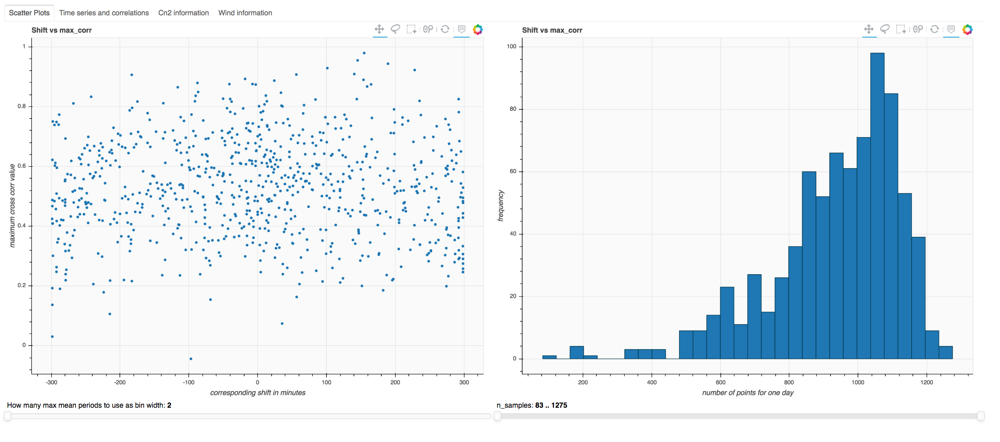
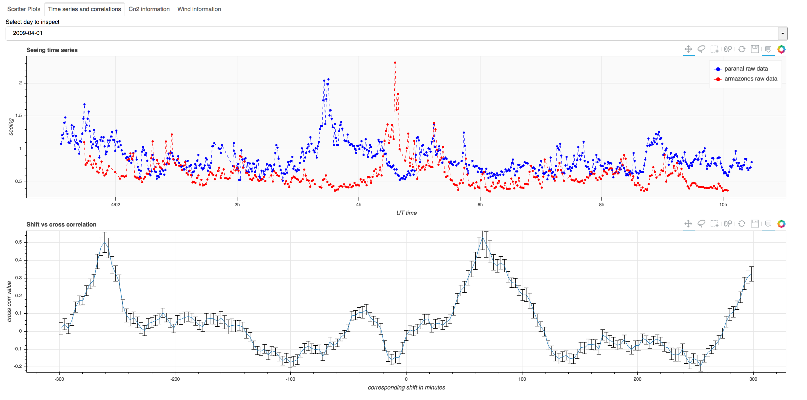
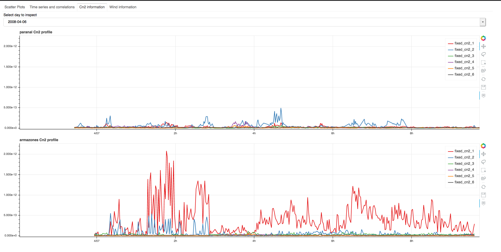
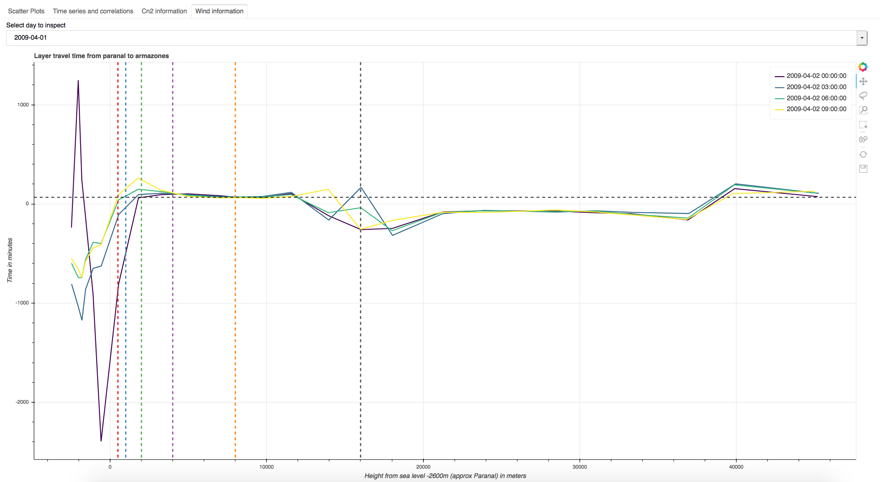

## GUI Module
This module is part of the NOWCAST proyect by [ESO](https://www.eso.org) that aims to do short-term-forecast of the [seeing](https://en.wikipedia.org/wiki/Astronomical_seeing) parameter in order to improve astronomical observations.

## Features
This module takes all the data made by the previous modules and uses it to generate a graphical user interface using [Bokeh](https://docs.bokeh.org/en/latest/index.html#).

## Setup

In order to have this module working, the first thing to do is to fill the ``data``folder with the following files:

  1) cn2_file1.df
  2) cn2_file2.df
  3) final_df.correlations
  4) max_corr_df.correlations
  5) numpy_data.matrices
  6) UTdf.all_days
  7) wind_data.df

The files number 1. and 2. are generated by a jupyter notebook not yet avaliable in a repository, for the other files you need to use the following modules:

  * [correlation module](https://github.com/tomasrojasc/correlation-module-nowcast): final_df.correlations, max_corr_df.correlations
  * [wind module](https://github.com/tomasrojasc/wind-module-nowcast): numpy_data.matrices, wind_data.df
  * [time series module](https://github.com/tomasrojasc/time-series-module-nowcast): UTdf.all_days

## Config file

In the ``modules`` folder there is the ``config.py`` file, where you can change the names of the sites to be displayed.

## How to use

In order to execute this module, you have to first install Bokeh and then run in the terminal the following command: ``bokeh serve --show main.py`` and a new tab will be opened in your web browser.

## Screenshots

One everything is done you should finish with something like this:

